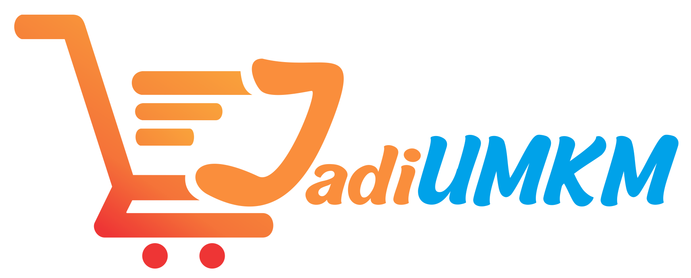

## About JadiUMKM

JadiUMKM.id adalah platform yang memberikan kesempatan kepada pelaku UMKM untuk belajar dan beralih ke ranah digital melalui marketplace online dan jasa freelancer content digital. Tujuan platform JadiUMKM.id adalah sebagai wadah bagi pelaku UMKM dalam belajar dan mengembangkan usahanya secara digital melalui website.

## Layanan JadiUMKM

1. Edukasi Digitalisasi Marketing
   Dalam rangka meningkatkan jumlah pelaku UMKM yang beralih ke digital, layanan ini bertujuan untuk memberikan edukasi kepada pelaku UMKM yang masih awam mengenai strategi pemasaran digital yang efektif, sehingga mereka dapat memiliki pengetahuan dan wawasan yang dibutuhkan.
2. Freelancer
   Dalam proses peralihan konvensional menjadi digital, pelaku UMKM membutuhkan banyak dukungan dan bantuan dari berbagai pihak. Salah satu pihak yang dapat membantu para pelaku UMKM adalah freelancer yang menyediakan berbagai jasa dan layanan, contohnya seperti desain grafis, pembuatan website, desain logo, digital marketing, dan lain sebagainya.
3. Marketplace
   Dalam era digital yang semakin maju ini, marketplace menjadi semakin penting bagi pelaku UMKM untuk meningkatkan pangsa pasar mereka. Dengan menggunakan layanan ini, para pelaku UMKM dapat menjangkau lebih banyak konsumen.

